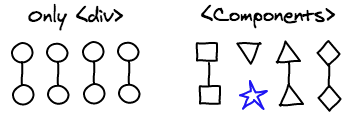

React diff 算法
===

> 这篇是译文，翻译自[Christopher Chedeau](http://blog.vjeux.com/)的[React’s diff algorithm](http://calendar.perfplanet.com/2013/diff/)。Christopher Chedeau（[@vjeux](https://twitter.com/vjeux)）是Facebook的软件工程师，也是React和React Native的开发者。

React是facebook开发的一个用于UI开发的基础库。它自底向上重新设计了，为了实现高性能。在这篇文章中将展示React的diff算法是如何来优化你的app性能的。

## diff算法
在我们详细解释算法之前，有必要了解下React是如何工作的。

    var MyComponent = React.createClass({
        render: function() {
            if (this.props.first) {
                return 
A Span
;
            }
            else {
                return 

A Paragraph

;
            }
        }
    });

上面的代码是用于绘制你的ui的。注意render方法返回的不是真正的DOM节点，而是轻量级的Javascript对象，简称虚拟DOM。

React就是使用这些虚拟DOM来计算出需要实现UI更新所需要的最少DOM操作。例如，如果我们先绘制`<MyComponent first={true} />`，然后再用`<MyComponent first={false} />`替换它，最后再删掉它。如下是我们需要做的DOM操作：

1. 默认DOM中是空的，需要创建一个节点`
A Span
`
2. 修改`MyComponent`的`first`属性为`false`需要做的DOM操作如下：
    1. 替换className属性：`className="first"` 替换为 `className="second"`
    2. 替换节点：`A Span`替换为`
A Paragraph
`
3. 删除`MyComponent`需要做的DOM操作是删除节点`

A Paragraph

`

### 同层对比

查找两个随机树之间的最小差异是一个O(n^3)问题。如你所想，这么高复杂度的算法是无法满足我们的需求的。React使用了一种更为简单且直观的算法使得算法复杂度优化至O(n)。

React只会逐层对比两颗随机树。这大大降低了diff算法的复杂度。并且在web组件中很少会将节点移动到不同的层级，经常只会在同一层级中移动。

### 列表
假设一个组件中原本有5个子组件，然后我们插入一个新的组件。 如果我们不知道新节点插入的位置，那么仅仅通过树的对比，我们很难找到两个树之间的对应关系。

默认情况下，React只能按照顺序将两组节点对应起来，可以预见，这样是很不准确的。这时候你可以提供一个key属性来帮助React找到更为精确的对应关系。实际使用中，我们也很容易为列表中的节点们找到唯一的key。

### 组件
一个React的app通常由许多用户自定义的组件组成，然后最终转换成一个由许多div组成的树。React的diff算法也考虑了这种情况，它仅仅会匹配相同class（此处不是指dom的className，而是组件的类别）的组件。

例如如果一个`<Header>`组件被一个`<ExampleBlock>`组件替换了，React会删除header然后创建一个example block。我们不想浪费宝贵的时间去计算两个根本不可能相似的组件。

## 事件代理
为DOM节点添加事件绑定是一件很慢并且消耗内存的事情。为了解决这个问题，React使用了一个常见的解决方案：事件代理。不过，React不仅仅做了这些，它走的更远。它实现了一个与W3C标准兼容的事件系统。这意味着你不会遇到IE8的那些事件绑定bug。所有的事件在各个浏览器上都是一致的。

让我来简单解释下它是怎么做的。首先在文档的根节点上绑定一个事件监听器。当一个事件触发时，浏览器会给到事件发生的目标节点（`event.target`）。为了让事件在DOM继承树之间传播，React不会迭代查找虚拟DOM的继承树。React要求每个组件都只有一个根节点，这个根节点有一个唯一的id。我们可以通过简单的字符串操作拿到所有祖先的id。把事件监听器的存储到一个map中，id作为map的key。我们发现这样获取事件监听器的性能比把事件监听器绑定到虚拟DOM上要快。如下是一个事件的分发过程：

    clickCaptureListeners['a'](event);
    clickCaptureListeners['a.b'](event);
    clickCaptureListeners['a.b.c'](event);
    clickBubbleListeners['a.b.c'](event);
    clickBubbleListeners['a.b'](event);
    clickBubbleListeners['a'](event);

浏览器为每一次监听器的回调都创建了一个新的event对象。这样开发者就可以保存甚至修改event对象，并且不会出现冲突。然后，这就需要分配大量的内存。React在一开始就分配了一个对象池，这可以显著减少垃圾回收的触发。

## 绘制

### 批量操作
当你在一个组件上调用其`setState`方法时，React会将其标记为dirty。然后在事件轮询结束时，React会查找dirty的组件并将其重新绘制。

这就意味着不论有多少此`setState`操作，React都只会在事件循环结束时批量更新DOM。这就是React高性能的关键。用通用js方法来实现这种批量更新是很麻烦的，而React默认会帮你搞定这些。

### 子树重绘

当组件的`setState`方法被调用时，组件会重新构建它的子节点。如果你在根元素上调用了`setState`方法，那么整个App都会被重绘。所有的组件的render方法都会被调用，即使它们并没有改变。虽然这听起来很吓人，好像很不高效。但实际上还可以，因为它根本没有修改真正的DOM。

首先，让我们讨论下UI界面的展示。因为空间是有限的，我们通常会同时按照顺序显示成百上千个元素。Javascript已经足够快了，万全可以hold住普通的业务逻辑需求。

另外一个重要点是，当你写React代码时不要经常调用root节点的setState方法来修改东西。你可以在触发事件的组件或是其父组件上调用setState方法。通常你不需要调用root的`setState`方法。这意味着你需要将UI改变控制在用户交互触发的区域。

### 优化子树的绘制
你可以控制是否阻止子树的重绘，只需要覆盖组件的方法即可，方法如下：

    boolean shouldComponentUpdate(objectnextProps, objectnextState)

通过对比组件前后的props和state，你就可以判断这个组件是否真的有必要重绘。只要实现妥当，会大大提升性能。

为了实现这个对比，你就需要对比Javascript对象。这会遇到很多问题，例如对象的对比是深度对比还是仅仅做浅层对比？如果我们用的深度对比，那么是应该使用不可变的（immutable）数据机构还是做深度拷贝呢？

还有一件事情你需要记住：`shouldComponentUpdate`函数会经常被调用，所以一定要确保你实现的函数比绘制组件所需要的时间更少。不然就没有优化的价值了。

## 结论

React所使用的技术并不新颖，我们很早就知道DOM操作很慢，批量读写可以提高性能，事件代理更快。

人们还在不厌其烦的叙述这些优化方法，那是因为在实战中这些还是很难实现的。React之所以性能好，是因为这些优化点都已经默认支持。除非你的脑门儿被夹了，否则你很难用React写出慢的app。

基于React的性能优化准则非常简单易懂：每次`setState`方法的调用都会重绘整个子树。如果你想优化性能，那么尽量在较“低”的节点上调用`setState`方法，或者自己实现`shouldComponentUpdate`方法来阻止整个子树的重绘。

