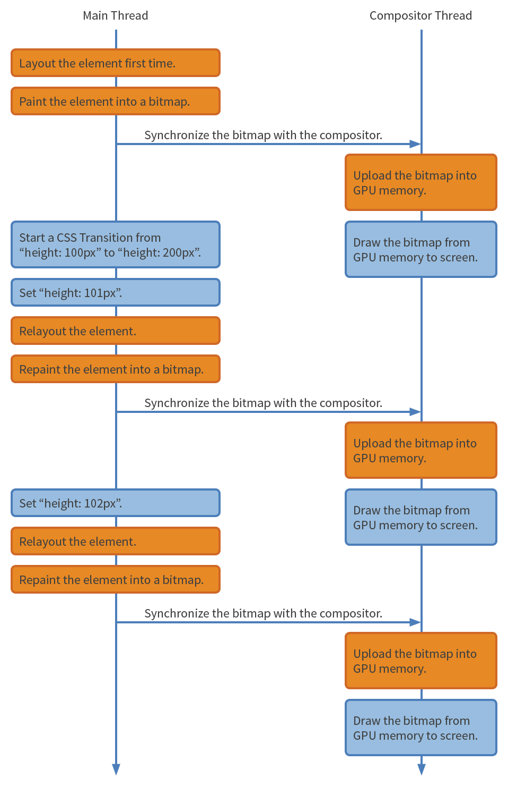

CSS animation和transition的性能探究
===

> 本篇文章翻译自adobe Web Platform Team的博客：[CSS animations and transitions performance: looking inside the browser](http://blogs.adobe.com/webplatform/2014/03/18/css-animations-and-transitions-performance/)。虽然是一篇旧文，但是里面谈到的知识点很有用。对CSS的性能优化有很大帮助。

你可能已经在你的项目中用上了[CSS Animation](http://www.w3.org/TR/css3-animations/)和[CSS transition](http://www.w3.org/TR/css3-transitions/)。如果还没有用上，那你有点out了。快去看下CSS-Trick上的这两篇关于[animation](http://css-tricks.com/almanac/properties/a/animation/)和[transition](http://css-tricks.com/almanac/properties/t/transition/)的文章。你在使用中一定发现了有些动画很流畅，而有些则很卡。为什么呢？

在这篇文章中，我们会想你解释浏览器是如何处理CSS Animation和CSS transition的。这样你就可以不写一行代码就能凭借自己的直觉判断一个动画是否流畅。你就可以设计出更适合浏览器的、更丝般柔滑的用户体验。

## 浏览器的内部机制

让我们拨开浏览器的头纱看看它到底是如何工作的。一旦我们明白其内部机制，便能驾驭它了。现代浏览器通常由两个重要的线程组成。这两个线程一起工作完成绘制页面的任务：

- 主线程
- 合成线程

主线程需要做的任务如下：

- 运行Javascript
- 计算HTML元素的CSS样式
- layout (relayout)
- 将页面元素绘制成一张或多张位图
- 将位图发送给合成线程

合成线程主要任务是：

- 利用GPU将位图绘制到屏幕上
- 让主线程将可见的或即将可见的位图发给自己
- 计算哪部分页面是可见的
- 计算哪部分页面是即将可见的（当你的滚动页面的时候）
- 在你滚动时移动部分页面

在很长的一段时间内，主线程都在忙于运行Javascript和绘制大型元素。当它忙碌的时候，它就没空响应用户的输入了。

换个角度说，合成线程一直在尝试保证对用户输入的响应。它会在页面改变时每秒绘制60次页面，即使页面还不完整。

例如，当用户滚动一个页面时，合成线程会让主线程提供最新的可见部分的页面位图。然而主线程不能及时的响应。这时合成线程不会等待，它会绘制已有的页面位图。对于没有的部分则绘制白屏。

## GPU

我之前提到了合成线程会使用GPU来绘制位图。让我们快速熟悉下GPU的概念。

如今大多数手机、平板和电脑都带有了GPU芯片。它非常的特别，它很擅长做某些事情，又很不擅长做其他事情。

GPUs在做如下操作时很快：

1. 绘制东西到屏幕上
2. 一次次绘制同一张位图到屏幕上
3. 绘制同一张位图到不同的位置、旋转角度和缩放比例

GPUs很不擅长做：

1. 加载位图到内存中

## transition: height

现在我们对运行页面的软件和硬件都有了一个粗略的了解。让我们来看看主线程和合成线程是如何处理CSS transition的。

假设我们将一个页面元素的高度从100px渐变到200px，代码如下：

    div {
        height: 100px;
        transition: height 1s linear;
    }
     
    div:hover {
        height: 200px;
    }

下图是一张主线程和合成线程的互相交互的时间线图。注意：黄色盒子的操作是潜在耗时较长的，蓝色盒子的操作是很快的。

你可以看到有很多黄色的盒子，这意味着浏览器要做很多复杂的操作。这就表明这个transition动画很可能会卡。

在transition动画的每一帧中，浏览器都要做下relayout和repaint，然后将位图发送给GPU。之前我们提到了，加载位图到GPU内存中是很慢的。

浏览器之所以这么拼命的工作是因为元素在不停的变化。而且修改元素的高度可能会导致子元素的大小也会变化，所以浏览器不得不进行relayout。在relayout之后主线程还需要重新生成元素的位图。

## transition: transform

所以高度的变化是很耗时的，有没有什么东西耗时更少呢？

假设我们将一个元素缩小到其一半大小。同时假设我们使用了[CSS transform属性](http://gitlab.baidu.com/help/workflow/workflow.md)来缩放元素。那么这个缩小动画的CSS如下：
    
    div {
        transform: scale(0.5);
        transition: transform 1s linear;
    }
     
    div:hover {
        transform: scale(1.0);
    }

让我们来看下这次的时间线图：

这次我们很少看到黄色盒子了，这就意味着这个动画可以很流畅！那么为什么transform的动画会和height的动画差别这么大呢？

依据规范，CSS transform属性并不会触发当前元素或附近元素的relayout。浏览器将当前元素视为一个整体，它会缩放、旋转、移动这一整个元素。

这对浏览器来说是个天大的好消息！浏览器只需要在动画开始之时生成位图，然后将位图发送给GPU。之后浏览器不需要做额外的relayout和repaint，甚至不需要发送位图给GPU。浏览器只需要充分发挥GPU的长处：绘制同一张位图到不同的位置、旋转角度和缩放比例。

## 设计意图

所以这是否意味着我们不应该使用height的动画呢？ 当然不是。有时这就是设计的需求，并且动画也可以足够快。可能你的元素是隔离的，并且不会导致其他部分的页面触发relayout。可能你的元素很简单，浏览器可以很快完成repaint。更可能你的元素很小，浏览器只需要发送一张很小的位图到GPU中。

当然，如果你可以在不影响设计意图的情况下使用一个更“便宜”的CSS属性自然是极好的。举个例子：你设计了一个按钮，在tap按钮之后弹出一个菜单。弹出的过程是一个CSS动画。按照一般思维，我们会用到CSS的top和height属性来实现弹出效果。但其实我们可以用更“便宜”的CSS transform属性来实现类似的弹出效果。

总结一下做动画时速度很快的CSS属性：

- [CSS transform](http://css-tricks.com/almanac/properties/t/transform/)
- [CSS opacity](http://css-tricks.com/almanac/properties/o/opacity/)
- [CSS filter](http://css-tricks.com/almanac/properties/f/filter/) （具体要看filter的复杂度）

这个列表目前很小，但是随着浏览器越来越先进，你会看到这个列表越变越大。同样的也不要小看这张列表上的属性。你会惊讶居然可以用这么几个简单的属性实现这么多复杂的动画效果。发挥你们的创造力吧！

