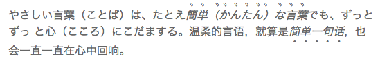

CSS3着重符及其fallback
===

在东亚国家，人们会在文章中重要文字旁加上小符号以突出其重要性。如下：

## 标准

在中文里面，我们一般会在文字下方加上圆形符号。在日语中会在文字上方加上小顿号。在CSS3中如下属性可以控制着重符号:

1.  [`text-emphasis`](http://www.w3.org/TR/css-text-decor-3/#text-emphasis)
2.  [`text-emphasis-style`](http://www.w3.org/TR/css-text-decor-3/#text-emphasis-style)
3.  [`text-emphasis-color`](http://www.w3.org/TR/css-text-decor-3/#text-emphasis-color)
4.  [`text-emphasis-position`](http://www.w3.org/TR/css-text-decor-3/#text-emphasis-position)

`text-emphasis`是`text-emphasis-style`和`text-emphasis-color`的快捷方式，注意它并不包含`text-emphasis-position`。

`text-emphasis-style`属性用于控制着重符号的样式。基本的符号形状有`dot | circle | double-circle | triangle | sesame`这几种，它们又分别有“空心（open）”、“填充（filled）”两种展现形式。当你只填了`filled`或`open`是，符号形状的默认值和文字是竖排还是横排（`writing-modes`）有关，比如横排时默认是`filled circle`，竖排时是`filled sesame`。如果你之前填了符号形状，则默认的展现形式是`filled`。当然你还可以自定义符号，但是只能显示一个字符。

另一个重要的属性是`text-emphasis-color`，它控制了着重符号的颜色，默认使用当前文字的颜色。

最后一个属性是`text-emphasis-position`，它有这几种可选值`[ over | under ] &amp;&amp; [ right | left ]`。它的默认值计算方式更为复杂些，与横竖排版和所处语言环境都有关系。横排情况下，中文环境默认值为`under`，日文环境默认值为`over`。竖排情况下，中文和日文环境下默认值都为`right`。

在CSS中，一般着重符号的字体大小是其对应文字的一半。且当行高有足够空间来绘制着重符时，它不会影响到对应文字的行高。

在2013年8月1日，这个标准成为“候选推荐标准”，这对喜爱文字排版的人来说是个好消息。遗憾地是目前只有webkit内核的浏览器是支持它的，并且需要使用`webkit`前缀。所以在使用时需要做fallback。

## FALLBACK

在做fallback时，有这么几点是需要考虑的：

1.  如何应对letter-spacing样式和文字宽度不一致的情况
2.  如何处理浏览器的最小字体配置
3.  如何空间是否足够绘制着重符（计算行高）
4.  如何减少对现有html的影响
5.  如何获得所处语言环境

### 一

对于第一点的解决方案是：对每个字符用span包裹，方法类似于[letter.js](http://letteringjs.com/)。然后在每个span内部插入另一个包含着重符的span，它的宽度为百分百，且绝对定位。如下面样例所示：

<iframe src="http://jsfiddle.net/zmmbreeze/C4KaB/embedded/result,html,css" height="300" width="100%" allowfullscreen="allowfullscreen" frameborder="0"></iframe>

对于有`letter-spacing`的情况，可以设置span的`letter-spacing`为0，然后使用`margin-right`来替代它。

### 二

如果你是用chrome，你可能已经注意到了“最小字体”导致的问题：着重符号太大了。在chrome下着重符号是12px，而不是8px（16/2）。为了解决问题2，我们需要想想其他方法。我首先考虑到的是zoom属性，它支持chrome（所有版本）、safari和IE。可惜的是在chrome下`zoom:0.5`也不能使字体变小。然后考虑到的是`transform:scale(0.5)`，幸运地是它能使文字比最小字体还要小。不过支持的浏览器不够多，参考[这里](http://caniuse.com/#search=transform)。所以必须要考虑在不支持`transform`的时候使用fallback。我的处理方法是使用绝对大小（px）。虽然不能使着重符号字体变小，但是至少可以保证着重符位置正确。

<iframe src="http://jsfiddle.net/zmmbreeze/C4KaB/1/embedded/result,html,css" height="300" width="100%" allowfullscreen="allowfullscreen" frameborder="0"></iframe>

### 三

在绘制着重符时，如果行高内有足够的高度，则着重符不会扩大行高。如果高度不够，则扩大行高。第二种情况需要设置`display:inline-block`; 及`padding-bottom`，来模拟行高高度的扩大。为了做高度是否充足的判断，我们就需要计算字体大小和行高。当你设置字体大小为1em时，对于IE这样的浏览器，获得地长度其实并不是以px为单位。这时需要一些hack：

    // http://erik.eae.net/archives/2007/07/27/18.54.15/#comment-102291
    var PIXEL = /^\d+(px)?$/i;
    function getPixelValue(element, value) {
        if (PIXEL.test(value)) {
            return parseInt(value);
        }
        var style = element.style.left;
        var runtimeStyle = element.runtimeStyle.left;
        element.runtimeStyle.left = element.currentStyle.left;
        element.style.left = value || 0;
        value = element.style.pixelLeft;
        element.style.left = style;
        element.runtimeStyle.left = runtimeStyle;
        return value;
    };

幸运地是，jQuery已经处理了这种情况。这样我们就可以得到正确的字体大小和行高（需要特殊处理行高为缩放因子和normal的情况）。不过受到了“文字可能比设置地字体大小更大”、“同行有更高行高的元素（例如图片）”等等特殊情况的限制，导致了计算结果并不一定正确。幸运地是对最终结果的影响并不是很大。

### 四

第四个问题指的是`innerText/$('em').text()`的返回值在做了fallback之后就不再正确了，同时受到影响的还有`innerHTML`。对于后者我没有想到好的方案。对于前者，我们可以把着重符放在span标签的before伪元素上。这样得到的`innerText`值还是正确的。不过也引入了另一个问题：如何用js修改before伪元素的样式。我采用的方法是插入css rule，下面有简单的代码。在实际情况下，因为不能删掉css rule，所以需要做好css rule的缓存复用。

    var styleSheet;
    function addCSSRule(selector, rules) {
        if (!styleSheet) {
            var style = document.createElement('style');
            style.type = 'text/css';
            $('head').eq(0).prepend(style);
            styleSheet = document.styleSheets[0];
        }

        if (styleSheet.insertRule) {
            styleSheet.insertRule(
                selector + '{' + rules + '}',
                styleSheet.cssRules.length
            );
        } else {
            // IE
            styleSheet.addRule(selector, rules, -1);
        }
    }

### 五

最后一个问题的解决方案则比较简单粗暴。获取`navigator.language || navigator.browserLanguage`的值判断其所处的语言环境。

### jQuery.emphasis.js

解决了这些问题之后，终于得到了一个可用的fallback。再根据标准来修改优化代码，就得到了[jQuery.emphasis.js](https://github.com/zmmbreeze/jquery.emphasis)。这里有些它的[demo](http://nodejs.in/jquery.emphasis/demo.html)。不过它没有解决所有的问题，目前已知的缺陷如下：

1.  不支持竖排（即不支持`position`为`right/left`）
2.  不支持特殊情况下的`inline-block`元素（比如默认元素有`padding-bottom`）
3.  如果浏览器不支持`transform`，则会有最小字体导致的着重符过大问题

如果你还发现了其他问题，欢迎[feedback](https://github.com/zmmbreeze/jquery.emphasis/issues)。

