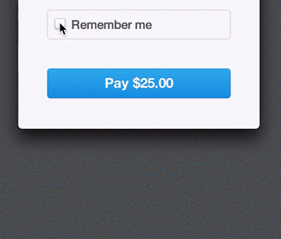
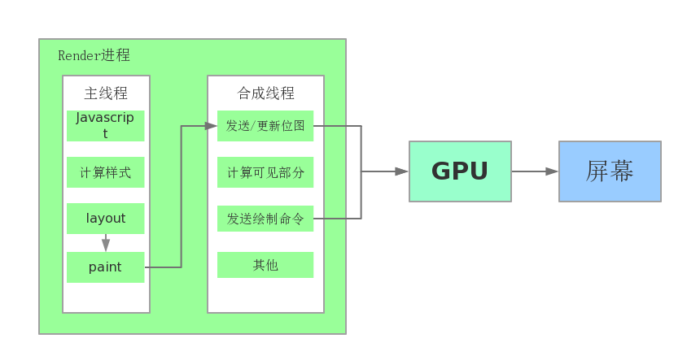

前端动画那些事儿
===

在Web页面中使用动画效果已经不是什么稀奇的事情了。但凡优秀的UI界面都会有一些点缀用的动画效果。举个例子，[Stripe Checkout小组](https://medium.com/@michaelvillar/improve-the-payment-experience-with-animations-3d1b0a9b810e)通过UI动画效果来增强支付体验。

图片来自@michaelvillar的[Improve the payment experience with animations](https://medium.com/@michaelvillar/improve-the-payment-experience-with-animations-3d1b0a9b810e)

可见通过UI动画来优化用户体验是一件值得去做的事情。目前我们有很多手段在页面中做动画效果：

1. flash
2. gif
3. [SVG](https://developer.mozilla.org/en-US/docs/Web/SVG/Element/animate)
3. javascript动画
4. CSS transition和animation

这里主要讨论的将会是最后两种Javascript和CSS动画，因为他们的适用范围较为广泛。

CSS动画
--

从CSS3开始，W3C开始推出了CSS transition和animation，目前他们都处于Working Draft阶段。使用这两者可以大大减少网页上实现动画效果的工作量。

CSS transition可以让你控制CSS属性更新时候的速度。可以让CSS属性更新时不立即完成，而是经过一段渐变的过程。例如下图修改图片的高宽和位置：

图片来自[MDN](https://developer.mozilla.org/en-US/docs/Web/Guide/CSS/Using_CSS_transitions#Which_CSS_properties_are_animatable.3F)。

可以显示地定义要更新的CSS属性、动画时长、timing-function以及延迟。CSS语法如下：

    div {
        transition: <property> <duration> <timing-function> <delay>;
    }

因为transition的过程是异步行为，所以在修改完CSS属性后立即取到的是值是中间值。如果你需要知道transition动画的结束时间点，然后在JS里面做些操作。那么你就需要用到`transitionEnd`事件。如下：

    el.addEventListener("transitionend", updateTransition, true);

CSS animation相比于transition更加灵活，颗粒度更细。Animation由两部分组成：一个描述CSS animation的样式，以及一系列表示动画由开始状态到结束状态的关键帧（keyframes）。使用样例如下：

    @keyframes flip {
      0% {
        transform: perspective(400px) rotate3d(0, 1, 0, -360deg);
        animation-timing-function: ease-out;
      }
    
      40% {
        transform: perspective(400px) translate3d(0, 0, 150px) rotate3d(0, 1, 0, -190deg);
        animation-timing-function: ease-out;
      }
    
      50% {
        transform: perspective(400px) translate3d(0, 0, 150px) rotate3d(0, 1, 0, -170deg);
        animation-timing-function: ease-in;
      }
    
      80% {
        transform: perspective(400px) scale3d(.95, .95, .95);
        animation-timing-function: ease-in;
      }
    
      100% {
        transform: perspective(400px);
        animation-timing-function: ease-in;
      }
    }
    
    h1 {
      animation-duration: 1s;
      animation-fill-mode: both;
      animation-name: flip;
      backface-visibility: visible;
    }

这段代码描述了`h1`的反转动画。从这段代码里面可以看到animation不仅仅可以描述开始和结束状态，更可以指定任意中间状态的值。

 

There are three key advantages to CSS animations over traditional script-driven animation techniques:

They're easy to use for simple animations; you can create them without even having to know JavaScript.
The animations run well, even under moderate system load. Simple animations can often perform poorly in JavaScript (unless they're well made). The rendering engine can use frame-skipping and other techniques to keep the performance as smooth as possible.
Letting the browser control the animation sequence lets the browser optimize performance and efficiency by, for example, reducing the update frequency of animations running in tabs that aren't currently visible.

Javascript动画
--

在蛮荒年代，

